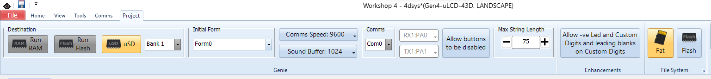
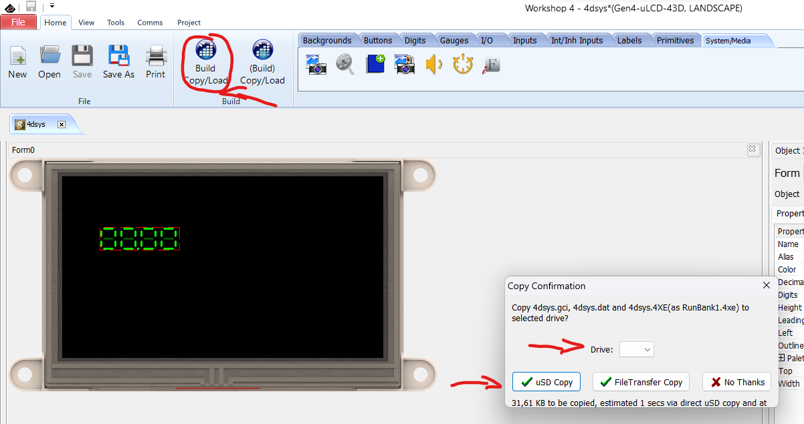
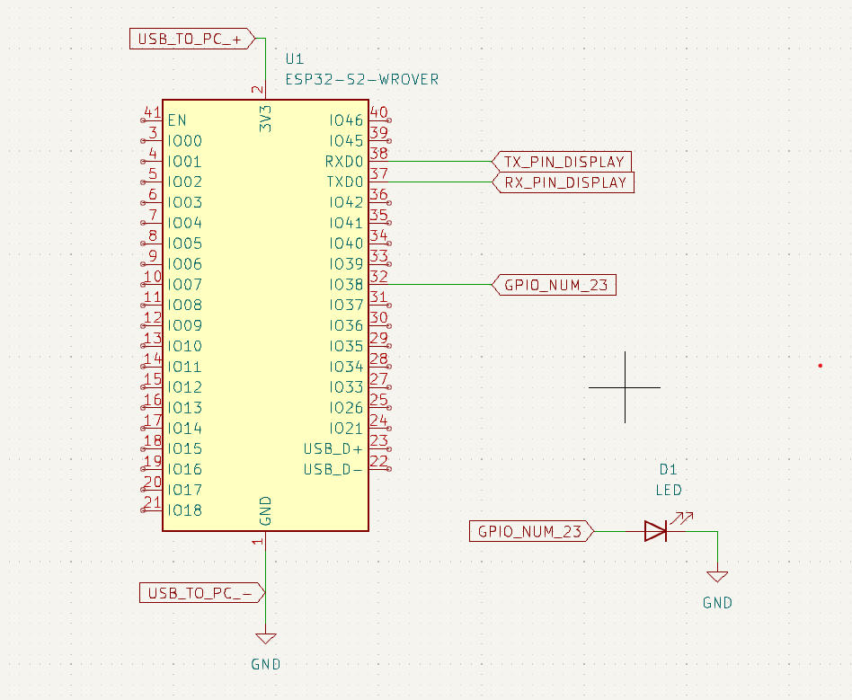

# Firmware documentation

## Project structure:
```
- Firmware /
            - CMakeLists.txt /* project wide CMake */

            - components/ - 4dsystems-project/ - 4dsys.4dGenie /* the project from 4D
                                                                  Workshop IDE */
                          - esp32-arduino /* the arduino interface for ESP, used for
                                             compatibility between visi-genie and the
                                             ESP-IDF build system */
                          - visi-genie /* the interface for display communication */

            - main/       - CMakeLists.txt /* main CMakeLists, used to include the main.c */
                          - main.cpp       /* the main file of the project */

            - misc/         /* photos included in the README.md file */

            - README.md     /* project README file */
```


# How to run this project:
Install the SDK:
1. Go to VS Code tutorial for ESP-IDF extension from [here](https://github.com/espressif/vscode-esp-idf-extension/blob/master/docs/tutorial/install.md)
2. Install the ESP-IDF using the "EXPRESS" setup
3. The project was made by using the release version 5.1.1

Install the 4DSystems IDE:
1. Go to the 4DSystems website from [here](https://4dsystems.com.au/software/)
2. Download the free version of Workshop4 IDE
3. Open the file components/4dsystems-project/4dsys.4DGenie with Workshop4 IDE
4. Extract the SDCard from the display and connect it to your computer
5. Click on the project tab and set the Destination, Initial Form, Comms Speed, Comms and File System as in the picture below

<p></p>

6. Click on the home tab and then click on the Build (Copy/Load) button
7. A window will pop up, there you need to select the drive, that being the SDCard
from the display

<p></p>

8. Then select uSD Copy
9. After that, pop the SDCard back inside the screen
10. After a power cycle, it will prompt the message "flashing complete"
11. Now the display programming is complete

Run the project:
1. Open this directory "Firmware" in VS Code
2. Build the project by using ESP-IDF Build Project button
3. Select the COM port to your board
4. Flash the project by using UART
5. Enjoy the endless loop of numbers incrementing on the screen!

Schematic:
<p></p>
NOTE: You will also need a 5V power supply in order to power up the display.


